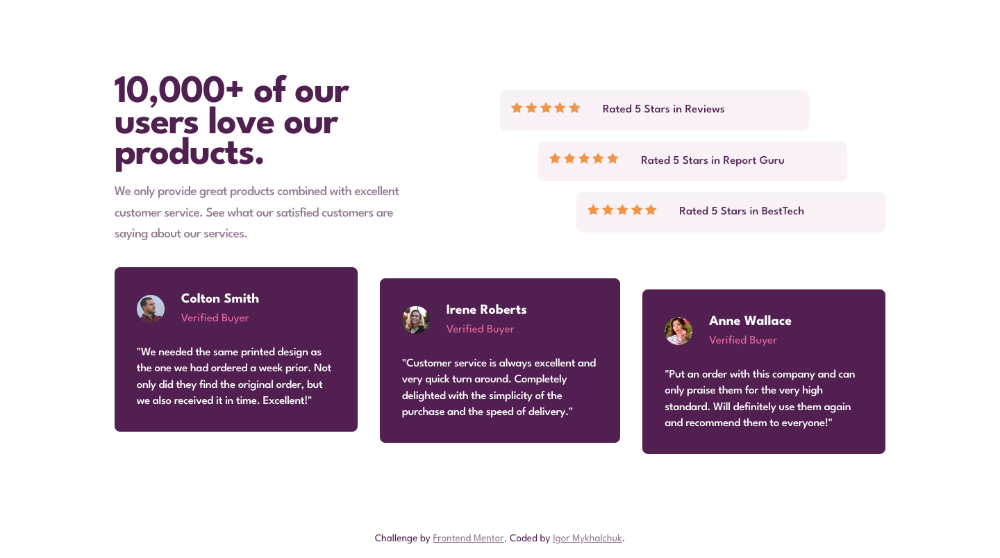
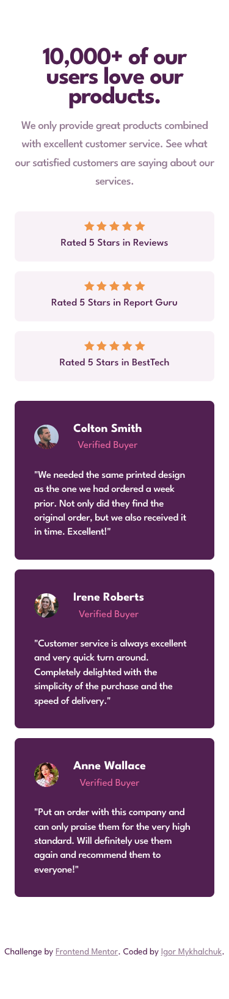

# Frontend Mentor - Social proof section solution

This is a solution to the [Social proof section challenge on Frontend Mentor](https://www.frontendmentor.io/challenges/social-proof-section-6e0qTv_bA). Frontend Mentor challenges help you improve your coding skills by building realistic projects. 

## The challenge

Your challenge is to build out this social proof section and get it looking as close to the design as possible.

Your users should be able to:

- View the optimal layout for the section depending on their device's screen size

### Screenshots

#### Desktop

  

#### Mobile

  

  

### Built with

- Semantic HTML5 markup
- CSS custom properties
- Flexbox
- Media queries
- Visual Studio Code
